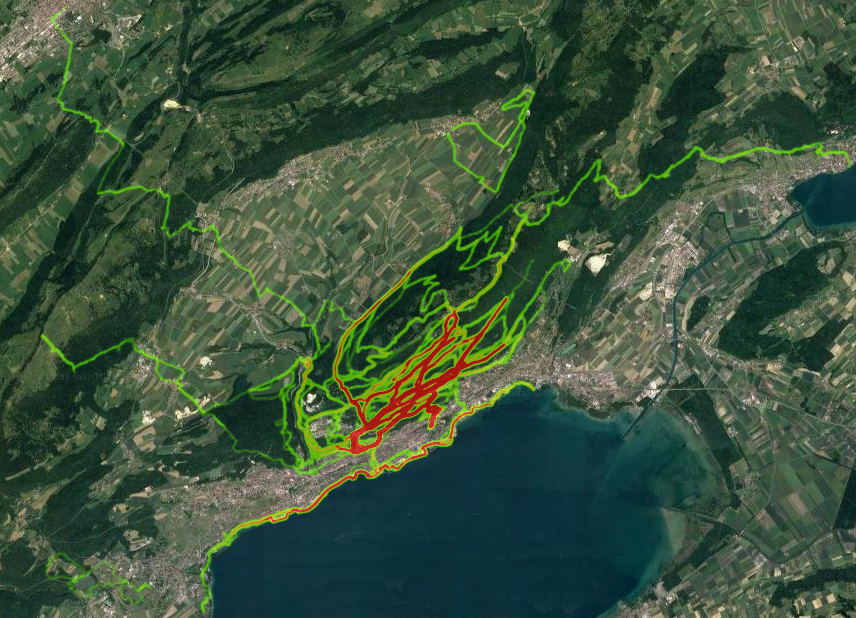

# KML2HEATMAP

version 0.1
14.09.2018
Author: Landon Halloran ([website](http://www.ljsh.ca))

## Description
A python script that creates a javascript-based heatmap from longitude, latitude coordinate pairs contained in kml files.

## Screenshots of example outputs

### Google Location History

### Running routes from GPS-enabled watch output

## What it does...
This script reads in kml files from a selected folder, parses the long/lat data from them, and then outputs an html file that uses the Google Maps Javascript API.
This has been tested with kml files exported from: 
- Google Location History (https://takeout.google.com/settings/takeout/downloads - warning output file can easily be >100MB)
- MapMyFitness/MapMyRun
- Suunto Movescount

## Inputs
- folder where kml files are located
- Google API key (see Requirements below)
- start longitude, latitude, & zoom level 

## Requirements:
- an API Key from the Google Cloud Platform Console https://developers.google.com/maps/documentation/javascript/get-api-key
- a folder containing only KML (keyhole mark-up language) files
- Python (tested with Python 3.6 via anaconda distribution)

## Included example files 
The subfolder `example_kml_files/` contains some kml files exported from a fitness tracking website (based on phone or GPS watch data).
